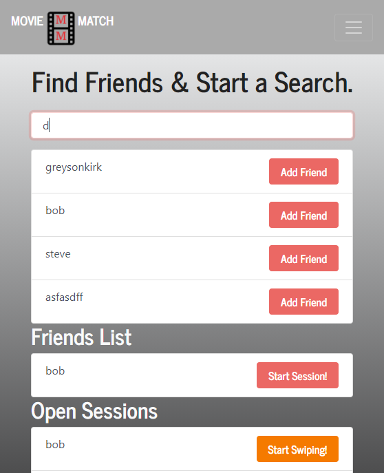

# Movie Match

### GitHub Link:
### Herkou Link:

### Overview 
This react app is designed for mulitple users to choose a service provider, media type, and genre, then swipe through the options to help decide which movie to watch. 

### API Used 
This app uses Movie of Tthe Night's streaming availabilty api. 
[Link to API](https://rapidapi.com/movie-of-the-night-movie-of-the-night-default/api/streaming-availability?endpoint=apiendpoint_0a5abaa1-0b88-49d1-8a66-5eb4572a73c1)

### Backend 
To limit amount of API calls, the initial users api call is stored into a MySQL db and that populates the "friends" movie page. 

### Issues
Main issue: Error 503 while added a movie picked in Huroku app, but not on localhost. 
This app isnt completed yet, so there's too many to list.

